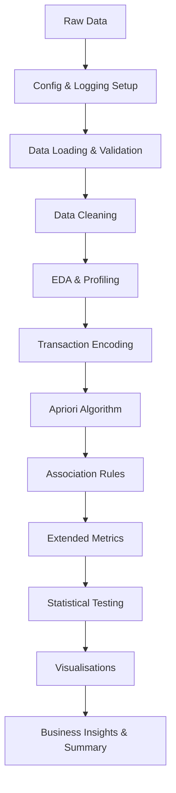

# 🛒 Market Basket Analyzer (Apriori Algorithm)

---

## 📌 Overview

The **Market Basket Analyzer** leverages the **Apriori algorithm** to discover relationships
between items in transactional data. It identifies frequently co-purchased products and generates
**association rules** to support data-driven business decisions such as promotions,
cross-selling, store-layout optimisation, and bundle pricing.

---

## ✨ Features

| Category | Feature |
|---|---|
| **Core Analysis** | Frequent itemset mining with Apriori |
| | Association rules (support, confidence, lift) |
| **Extended Metrics** | Leverage, conviction, Kulczynski coefficient |
| **Statistical Testing** | Chi-square independence test per rule |
| **Visualisations** | Scatter, bar charts, network graphs, heatmaps, parallel coordinates |
| **Data Profiling** | Sparsity metrics, basket-size outlier detection, item frequency analysis |
| **Business Intelligence** | ROI / revenue-impact estimation, cross-sell scores, bundle & layout hints |
| **Production-Ready** | YAML configuration, structured logging, data validation, `requirements.txt` |

---

## 📂 Repository Structure

```
MARKET-BASKET-ANALYZER/
├── MARKET-BASKET-ANALYZER.ipynb   ← Main analysis notebook
├── config.yaml                    ← Parameter configuration file
├── requirements.txt               ← Python dependencies
└── README.md                      ← This file
```

---

## 📊 Dataset

Expected columns in the CSV file (path configured in `config.yaml`):

| Column | Description |
|---|---|
| `Member_number` | Customer identifier |
| `Date` | Transaction date |
| `itemDescription` | Purchased item name |

---

## 🛠 Tech Stack

- **Python 3.8+**
- `pandas`, `numpy` – data manipulation
- `matplotlib`, `seaborn` – static visualisations
- `plotly` – interactive visualisations
- `mlxtend` – Apriori algorithm & association rules
- `networkx` – network graph visualisation
- `scipy` – chi-square statistical tests
- `scikit-learn` – K-Means rule clustering
- `pyyaml` – configuration management
- Jupyter Notebook

---

## 🚀 Installation & Setup

### 1. Clone the Repository

```bash
git clone https://github.com/simonmateli/MARKET-BASKET-ANALYZER.git
cd MARKET-BASKET-ANALYZER
```

### 2. Install Dependencies

```bash
pip install -r requirements.txt
```

### 3. Configure the Analysis

Edit `config.yaml` to set your dataset path and tuning parameters:

```yaml
data:
  filepath: "Groceries_dataset.csv"   # ← update this

apriori:
  min_support: 0.001
  metric: "confidence"
  min_threshold: 0.05
```

### 4. Run the Notebook

```bash
jupyter notebook MARKET-BASKET-ANALYZER.ipynb
```

---

## 🔧 Parameter Tuning Guide

| Parameter | Effect | Recommendation |
|---|---|---|
| `min_support` | Lower → more (weaker) rules | Start at 0.001; raise to reduce noise |
| `min_threshold` | Lower → more rules | 0.05 for exploration; 0.2+ for high-quality rules |
| `metric` | Filtering criterion | `"confidence"` or `"lift"` are most informative |
| `max_len` | Max items per itemset | `null` = unlimited; set to 2–3 for speed |

---

## 📈 Metrics Reference

| Metric | Range | Interpretation |
|---|---|---|
| **Support** | 0–1 | Fraction of transactions containing the rule |
| **Confidence** | 0–1 | P(consequent \| antecedent) |
| **Lift** | 0–∞ | > 1 = positive association; 1 = independent; < 1 = negative |
| **Leverage** | −1–1 | Deviation from statistical independence |
| **Conviction** | 0–∞ | Higher = rule is less likely by chance; ∞ when confidence = 1 |
| **Kulczynski** | 0–1 | Symmetric strength; > 0.5 = strong co-occurrence |

---

## 🔄 Workflow



---

## 📋 Notebook Sections

1. **Configuration & Logging** – load `config.yaml`, set up logging
2. **Importing Libraries** – all dependencies in one place
3. **Data Loading & Validation** – load CSV, run quality checks
4. **Data Cleaning & Exploration** – null handling, deduplication
5. **Exploratory Data Analysis** – top/bottom items, customer behaviour, segmentation
6. **Enhanced Data Profiling** – sparsity, basket-size outliers, frequency distribution
7. **Data Transformation** – one-hot encoding with `TransactionEncoder`
8. **Apriori Algorithm** – frequent itemsets + association rules
9. **Extended Metrics** – leverage, conviction, Kulczynski
10. **Statistical Testing** – chi-square tests for each rule
11. **Comprehensive Visualisations** – 8 plot types
12. **Business Intelligence** – ROI estimation, cross-sell scores, layout hints
13. **Key Findings Summary** – concise printout of results

---

## 💡 Key Insights

- Most associations are weak (low support) — typical for large item catalogs
- A small subset of rules shows high lift and statistical significance
- Core grocery items (milk, bread, vegetables) form consistent basket clusters
- Top rules can be directly applied to cross-selling and promotional campaigns

---

## 🏢 Use Cases

- Product recommendation systems
- Cross-selling & upselling strategies
- Retail store layout optimisation
- Bundle pricing design
- Inventory management and demand planning

---

## 🔮 Future Improvements

- Implement FP-Growth for faster frequent-itemset mining
- Temporal analysis of seasonal association shifts
- Deploy as an interactive web app (Streamlit / Dash)
- Real-time recommendation API
- Integration with BI tools (Tableau, Power BI)

---

## 🤝 Contributing

1. Fork the repository
2. Create a feature branch: `git checkout -b feature/my-enhancement`
3. Commit changes: `git commit -m "Add my enhancement"`
4. Push and open a pull request

---

## 📄 License

MIT License
