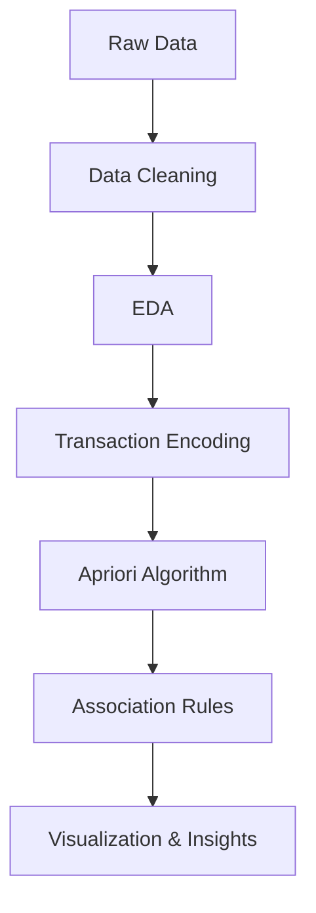

# 🛒 Market Basket Analyzer (Apriori Algorithm)

---

## 📌 Overview
The **Market Basket Analyzer** leverages the **Apriori algorithm** to discover relationships between items in transactional data. It identifies frequently co-purchased products and generates **association rules** to support data-driven business decisions like promotions, recommendations, and store layout optimization.

---

## 📸 Project Preview

### 🔝 Top Purchased Items


### 📊 Basket Size Distribution


### 🔗 Association Rules Scatter Plot


### 🕸️ Item Relationship Network


---

## Features
- Data preprocessing and cleaning  
- Exploratory Data Analysis (EDA)  
- Customer transaction insights  
- Basket size analysis  
- Frequent itemset mining using Apriori  
- Association rule generation (support, confidence, lift)  
- Data visualization (charts + network graphs)  

---

## Dataset
- Member_number → Customer ID  
- Date → Transaction date  
- itemDescription → Purchased item  

---

## Tech Stack
- Python  
- pandas, numpy  
- matplotlib, seaborn  
- mlxtend  
- networkx  
- Jupyter Notebook  

---

## Workflow



---

## Installation & Setup

### Clone the Repository
```bash
git clone https://github.com/your-username/market-basket-analyzer.git
cd market-basket-analyzer
```

### Install Dependencies
```bash
pip install pandas numpy matplotlib seaborn mlxtend networkx
```

### Run the Notebook
```bash
jupyter notebook
```

---

## Key Insights
- Customers purchase items in patterns  
- Most associations are weak, but some are valuable  
- Strong rules support targeted marketing  
- Core grocery items form consistent basket clusters  

---

## Use Cases
- Product recommendation systems  
- Cross-selling strategies  
- Retail optimization  
- Customer behavior analysis  

---

## Future Improvements
- Implement FP-Growth  
- Deploy as a web app  
- Build real-time recommendations  
- Integrate with BI tools  

---

## Contributing
1. Fork the repo  
2. Create a branch  
3. Make changes  
4. Submit a pull request  

---

## License
MIT License
